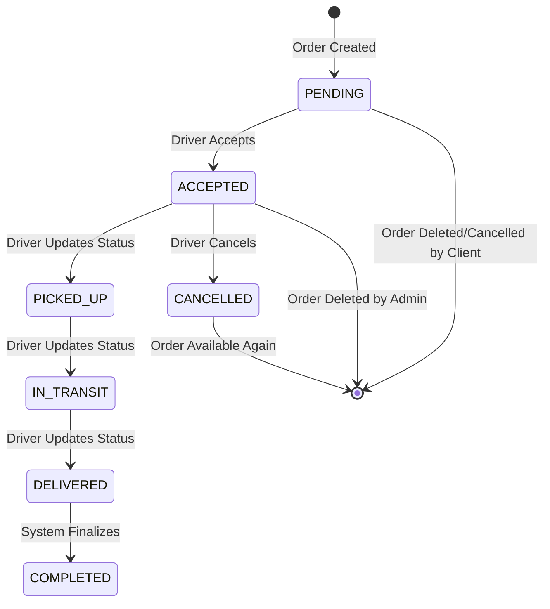

## Driver Endpoints: Complete API Reference

This document provides a comprehensive overview of all driver-facing API endpoints in the delivery system. It covers order management, location updates, profile management, and the newly implemented order cancellation functionality. The focus is on providing clear, secure, and efficient interactions from the driver's mobile application perspective.

### 1. Authentication and Authorization

All driver endpoints require authentication via Firebase JWT tokens. The middleware validates the user's role as "driver" before allowing access to these endpoints. Unauthorized access returns a 403 Forbidden response.

### 2. Order Management

Drivers interact with orders through several key endpoints, from viewing available orders to accepting and managing their assignments.

#### 2.1. Get Available Orders

Drivers can view all pending orders that are available for acceptance.

*   **Endpoint:** `GET /driver/available-orders` ([`get_available_orders`](app/api/driver_routes.py:16))
*   **Description:** Retrieves a list of all orders with `PENDING` status that drivers can accept.
*   **Authentication:** Required (Driver role)
*   **Request:** None (GET request)
*   **Response (Body):** `List[OrderResponse]` ([`OrderResponse`](app/schemas/order_schemas.py:25))
    ```json
    [
        {
            "id": "order-uuid-123",
            "client_id": "client-uuid-456",
            "driver_id": null,
            "order_type": "ride_hailing",
            "status": "pending",
            "pickup_address": "123 Main St, City",
            "pickup_latitude": "34.0522",
            "pickup_longitude": "-118.2437",
            "dropoff_address": "456 Oak Ave, City",
            "dropoff_latitude": "34.0522",
            "dropoff_longitude": "-118.2437",
            "price": 38.00,
            "distance_km": 10.5,
            "special_instructions": "Handle with care",
            "created_at": "2025-10-27T09:30:00.000Z",
            "payment_status": "pending",
            "total_paid": 0.00,
            "total_refunded": 0.00
        }
    ]
    ```

#### 2.2. Accept Order

Drivers can accept available orders, assigning themselves to the delivery task.

*   **Endpoint:** `POST /driver/accept-order/{order_id}` ([`accept_order`](app/api/driver_routes.py:27))
*   **Description:** Assigns a pending order to the authenticated driver, changing its status to `ACCEPTED`.
*   **Authentication:** Required (Driver role)
*   **Request (Path Parameter):** `order_id` (string)
*   **Request (Body):** [`OrderAccept`](app/schemas/order_schemas.py:50)
    ```json
    {
        "driver_id": "driver-uuid-789",
        "estimated_price": 38.00
    }
    ```
*   **Response (Body):** [`OrderResponse`](app/schemas/order_schemas.py:25)
    ```json
    {
        "id": "order-uuid-123",
        "client_id": "client-uuid-456",
        "driver_id": "driver-uuid-789",
        "order_type": "ride_hailing",
        "status": "accepted",
        "pickup_address": "123 Main St, City",
        "pickup_latitude": "34.0522",
        "pickup_longitude": "-118.2437",
        "dropoff_address": "456 Oak Ave, City",
        "dropoff_latitude": "34.0522",
        "dropoff_longitude": "-118.2437",
        "price": 38.00,
        "distance_km": 10.5,
        "special_instructions": "Handle with care",
        "created_at": "2025-10-27T09:30:00.000Z",
        "payment_status": "pending",
        "total_paid": 0.00,
        "total_refunded": 0.00
    }
    ```
*   **Error Responses:**
    *   403: "Cannot accept order for another driver" (if driver_id doesn't match authenticated user)
    *   404: Order not found

#### 2.3. Get My Orders

Drivers can view all orders assigned to them, regardless of status.

*   **Endpoint:** `GET /driver/my-orders` ([`get_my_orders`](app/api/driver_routes.py:44))
*   **Description:** Retrieves all orders where the authenticated driver is assigned (driver_id matches).
*   **Authentication:** Required (Driver role)
*   **Request:** None (GET request)
*   **Response (Body):** `List[OrderResponse]` ([`OrderResponse`](app/schemas/order_schemas.py:25))
    ```json
    [
        {
            "id": "order-uuid-123",
            "client_id": "client-uuid-456",
            "driver_id": "driver-uuid-789",
            "order_type": "ride_hailing",
            "status": "accepted",
            "pickup_address": "123 Main St, City",
            "pickup_latitude": "34.0522",
            "pickup_longitude": "-118.2437",
            "dropoff_address": "456 Oak Ave, City",
            "dropoff_latitude": "34.0522",
            "dropoff_longitude": "-118.2437",
            "price": 38.00,
            "distance_km": 10.5,
            "special_instructions": "Handle with care",
            "created_at": "2025-10-27T09:30:00.000Z",
            "payment_status": "pending",
            "total_paid": 0.00,
            "total_refunded": 0.00
        }
    ]
    ```

#### 2.4. Update Order Status

Drivers can update the status of orders assigned to them as they progress through the delivery workflow.

*   **Endpoint:** `PUT /driver/orders/{order_id}/status` ([`update_order_status`](app/api/driver_routes.py:55))
*   **Description:** Updates the order status (e.g., from `ACCEPTED` to `PICKED_UP`, `IN_TRANSIT`, `DELIVERED`, etc.).
*   **Authentication:** Required (Driver role)
*   **Authorization:** Only the assigned driver can update the order status
*   **Request (Path Parameter):** `order_id` (string)
*   **Request (Body):** [`OrderStatusUpdate`](app/schemas/order_schemas.py:47)
    ```json
    {
        "status": "picked_up"
    }
    ```
*   **Response (Body):** [`OrderResponse`](app/schemas/order_schemas.py:25)
    ```json
    {
        "id": "order-uuid-123",
        "client_id": "client-uuid-456",
        "driver_id": "driver-uuid-789",
        "order_type": "ride_hailing",
        "status": "picked_up",
        "pickup_address": "123 Main St, City",
        "pickup_latitude": "34.0522",
        "pickup_longitude": "-118.2437",
        "dropoff_address": "456 Oak Ave, City",
        "dropoff_latitude": "34.0522",
        "dropoff_longitude": "-118.2437",
        "price": 38.00,
        "distance_km": 10.5,
        "special_instructions": "Handle with care",
        "created_at": "2025-10-27T09:30:00.000Z",
        "payment_status": "pending",
        "total_paid": 0.00,
        "total_refunded": 0.00
    }
    ```
*   **Error Responses:**
    *   403: "Not authorized to update this order" (if driver is not assigned to the order)

#### 2.5. Cancel Order (NEW FEATURE)

Drivers can cancel orders that they have accepted but not yet completed. This is useful for situations where the driver encounters issues or changes their availability.

*   **Endpoint:** `POST /driver/orders/{order_id}/cancel` ([`cancel_order`](app/api/driver_routes.py:74))
*   **Description:** Cancels an order assigned to the authenticated driver, changing its status to `CANCELLED`. Only orders in `ACCEPTED` status can be cancelled.
*   **Authentication:** Required (Driver role)
*   **Authorization:** Only the assigned driver can cancel their own orders
*   **Request (Path Parameter):** `order_id` (string)
*   **Request (Body):** None (POST request)
*   **Response (Body):** [`OrderResponse`](app/schemas/order_schemas.py:25)
    ```json
    {
        "id": "order-uuid-123",
        "client_id": "client-uuid-456",
        "driver_id": "driver-uuid-789",
        "order_type": "ride_hailing",
        "status": "cancelled",
        "pickup_address": "123 Main St, City",
        "pickup_latitude": "34.0522",
        "pickup_longitude": "-118.2437",
        "dropoff_address": "456 Oak Ave, City",
        "dropoff_latitude": "34.0522",
        "dropoff_longitude": "-118.2437",
        "price": 38.00,
        "distance_km": 10.5,
        "special_instructions": "Handle with care",
        "created_at": "2025-10-27T09:30:00.000Z",
        "payment_status": "pending",
        "total_paid": 0.00,
        "total_refunded": 0.00
    }
    ```
*   **Business Rules:**
    *   Order must exist and be assigned to the requesting driver
    *   Order status must be `ACCEPTED` (cannot cancel orders that are already in transit or completed)
    *   After cancellation, the order becomes available for other drivers to accept
*   **Error Responses:**
    *   403: "Order not assigned to this driver"
    *   400: "Order cannot be cancelled in its current state"
    *   404: "Order not found"

### 3. Location Management

Drivers must keep their location updated for real-time tracking and proximity-based notifications.

#### 3.1. Update Location

Drivers can update their current GPS coordinates for tracking and order matching.

*   **Endpoint:** `POST /driver/location` ([`update_location`](app/api/driver_routes.py:89))
*   **Description:** Updates the driver's current location in Redis for real-time tracking and proximity calculations.
*   **Authentication:** Required (Driver role)
*   **Request (Body):** [`DriverLocationUpdate`](app/schemas/user_schemas.py:25)
    ```json
    {
        "latitude": 34.0522,
        "longitude": -118.2437
    }
    ```
*   **Response (Body):**
    ```json
    {
        "message": "Location updated successfully"
    }
    ```

### 4. Profile Management

Drivers can manage their profile information and availability status.

#### 4.1. Update Driver Profile

Drivers can update their personal and vehicle information.

*   **Endpoint:** `PUT /driver/profile` ([`update_driver_profile_route`](app/api/driver_routes.py:96))
*   **Description:** Updates the driver's profile information including personal details and vehicle information.
*   **Authentication:** Required (Driver role)
*   **Request (Body):** [`DriverProfileUpdate`](app/schemas/user_schemas.py:30)
    ```json
    {
        "email": "driver@example.com",
        "full_name": "John Doe",
        "phone_number": "+1234567890",
        "license_no": "DL123456",
        "vehicle_type": "sedan"
    }
    ```
*   **Response (Body):** [`DriverResponse`](app/schemas/user_schemas.py:10)
    ```json
    {
        "driver_id": "driver-uuid-789",
        "license_no": "DL123456",
        "vehicle_type": "sedan",
        "is_available": true,
        "user": {
            "id": "user-uuid-789",
            "email": "driver@example.com",
            "full_name": "John Doe",
            "phone_number": "+1234567890",
            "role": "driver",
            "created_at": "2025-01-01T00:00:00.000Z"
        }
    }
    ```

#### 4.2. Update Driver Availability

Drivers can toggle their availability status to control whether they receive new order assignments.

*   **Endpoint:** `PUT /driver/profile/availability` ([`update_driver_availability_route`](app/api/driver_routes.py:125))
*   **Description:** Updates the driver's availability status, affecting whether they appear in active driver pools.
*   **Authentication:** Required (Driver role)
*   **Request (Body):** [`DriverAvailabilityUpdate`](app/schemas/user_schemas.py:40)
    ```json
    {
        "is_available": true
    }
    ```
*   **Response (Body):** [`DriverResponse`](app/schemas/user_schemas.py:10)
    ```json
    {
        "driver_id": "driver-uuid-789",
        "license_no": "DL123456",
        "vehicle_type": "sedan",
        "is_available": true,
        "user": {
            "id": "user-uuid-789",
            "email": "driver@example.com",
            "full_name": "John Doe",
            "phone_number": "+1234567890",
            "role": "driver",
            "created_at": "2025-01-01T00:00:00.000Z"
        }
    }
    ```

### 5. Order Status Flow and Driver Actions

The system supports a complete order lifecycle with driver actions at each stage:



**Driver Actions by Status:**
*   **PENDING:** Driver can accept the order
*   **ACCEPTED:** Driver can update to PICKED_UP, or cancel the order
*   **PICKED_UP:** Driver can update to IN_TRANSIT
*   **IN_TRANSIT:** Driver can update to DELIVERED
*   **DELIVERED/COMPLETED:** No further driver actions
*   **CANCELLED:** Order becomes available for other drivers

### 6. Error Handling and Common Issues

All endpoints follow consistent error response patterns:

*   **400 Bad Request:** Invalid request data or business rule violation
*   **403 Forbidden:** Authentication or authorization failure
*   **404 Not Found:** Resource doesn't exist
*   **500 Internal Server Error:** Unexpected server error

**Common Error Scenarios:**
*   Attempting to cancel an order not in ACCEPTED status
*   Trying to update an order assigned to another driver
*   Submitting invalid location coordinates
*   Updating profile with missing required fields

### 7. Real-time Updates and Notifications

The driver app receives real-time updates through WebSocket connections and push notifications:

*   **Order Assignment:** When a driver accepts an order
*   **Status Changes:** When order status changes (by driver or system)
*   **New Orders:** When orders become available in driver's area
*   **Location Tracking:** Client can track driver location during delivery

### 8. Security Considerations

*   All endpoints require valid Firebase JWT authentication
*   Role-based access control ensures only drivers can access driver endpoints
*   Order ownership validation prevents drivers from modifying others' orders
*   Input validation prevents malicious data injection
*   Rate limiting protects against abuse

This comprehensive API reference ensures drivers can efficiently manage their workflow while maintaining system integrity and security.