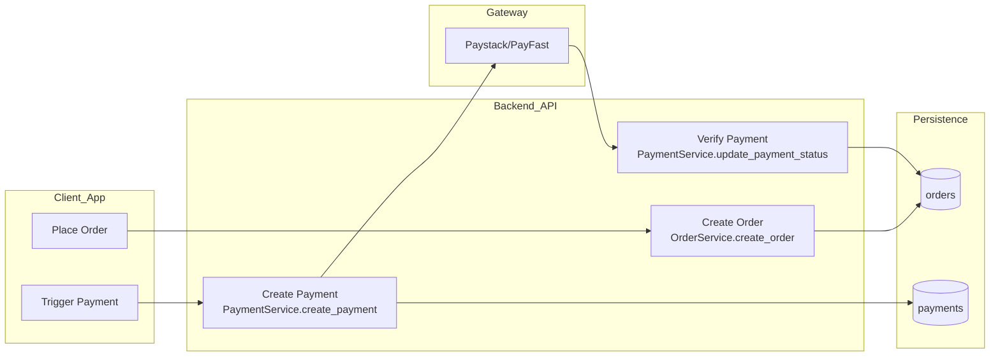
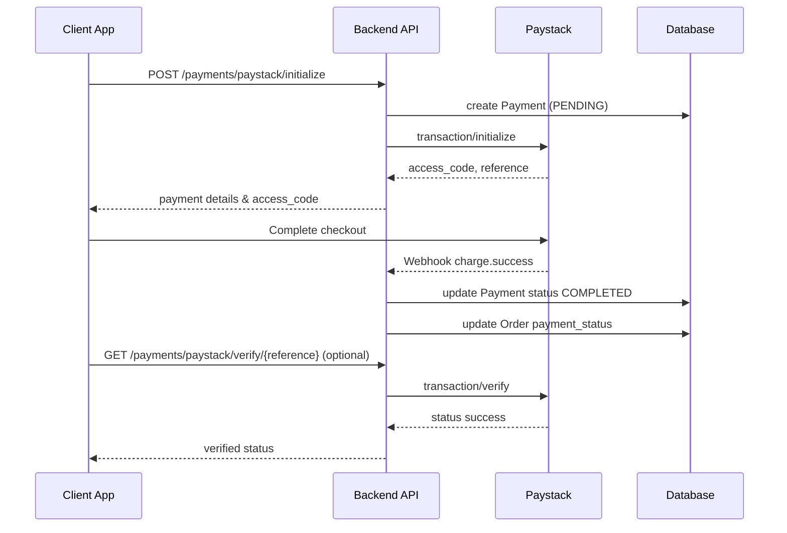

# order_payment_flow.md Planning Notes

## Source References
- [`OrderService.create_order()`](app/services/order_service.py:41) establishes order creation, price calculation, and initial `payment_status` = `pending` while caching state.
- [`PaymentService.create_payment()`](app/services/payment_service.py:24) covers payment record creation, gateway branching (PayFast signature prep) and ties payments to order totals.
- [`PaymentService.update_payment_status()`](app/services/payment_service.py:142) updates payment state and recomputes order `payment_status`, `total_paid`, and `total_refunded`.
- [`PaymentService.create_refund()`](app/services/payment_service.py:218) handles refund lifecycle and its impact on order balances.
- [`payment_routes.initialize_paystack_payment()`](app/api/payment_routes.py:30) provides Paystack initialization, access code retrieval, and reference storage.
- [`payment_routes.create_payment()`](app/api/payment_routes.py:161) is the generic payment creation endpoint (PayFast & cash scenarios).
- [`payment_routes.update_payment_status()`](app/api/payment_routes.py:226) exposes manual status updates for cash confirmation.
- [`payment_routes.paystack_webhook()`](app/api/payment_routes.py:433) and [`payment_routes.verify_paystack_payment()`](app/api/payment_routes.py:479) drive Paystack verification.
- [`payment_routes.paystack_callback()`](app/api/payment_routes.py:551) documents redirect verification flow.
- [`client_routes.create_order()`](app/api/client_routes.py:17) binds order creation to authenticated clients.
- Model schemas for cross-referencing:
  - [`Order`](app/models/order_models.py:26)
  - [`Payment`](app/models/payment_models.py:30)
  - [`PaymentCreate`](app/schemas/payment_schemas.py:7)
  - [`PaymentResponse`](app/schemas/payment_schemas.py:18)
  - [`PaymentUpdate`](app/schemas/payment_schemas.py:34)
  - [`OrderResponse`](app/schemas/order_schemas.py:25)

## Proposed Document Outline

1. **Introduction & Scope**
   - Clarify that `order_payment_flow.md` focuses on client orders and payment verification across Paystack, PayFast, and cash.
   - Summarize objectives: mapping endpoints, data flow, state transitions, and verification checkpoints.

2. **Domain Context**
   - Brief overview of order lifecycle statuses (`pending` → `completed`) sourced from [`OrderStatus`](app/models/order_models.py:17).
   - Explain payment entities (`Payment`, `Refund`) and status enums from [`PaymentStatus`](app/models/payment_models.py:13).

3. **Order Lifecycle Overview**
   - Describe how orders are created via `/api/client/orders`, accepted, fulfilled, and when payment confirmation is expected.
   - Include key moments when payment state must change (creation, gateway success, delivery confirmation).

4. **Data Model & Schema Snapshot**
   - Table summarizing key fields linking orders and payments: `order_id`, `user_id`, `payment_status`, `total_paid`, `total_refunded`.
   - Reference relevant schemas (OrderResponse, PaymentResponse, PaymentCreate, PaymentUpdate).

5. **API Endpoint Matrix**
   - List involved endpoints grouped by responsibility:
     - Order creation & retrieval (`/api/client/orders`, `/api/orders/{id}/...`).
     - Payment initiation (`/api/payments/create`, `/api/payments/paystack/initialize`).
     - Verification endpoints (webhook, manual verify, callback).
     - Status updates (`/api/payments/{payment_id}/status`).
   - For each endpoint include method, auth requirements, expected request schema, and success/error responses.

6. **Gateway-Specific Payment Flows**
   - **Paystack Card Payments**
     - Sequence narrative: initialize → Paystack checkout → webhook/verify → order payment update.
     - Detail request/response payloads for initialization and verification referencing [`PaymentCreate`](app/schemas/payment_schemas.py:7) fields.
     - Document amount reconciliation (kobo vs rand), signature considerations, and failure handling.
     - Show how `PaymentService.update_payment_status()` transitions order `payment_status`.
   - **PayFast Redirect Payments**
     - Capture PayFast form fields generated by [`PaymentService.create_payment()`](app/services/payment_service.py:24) and signature generation logic.
     - Describe notify_url expectations (if implemented) and manual verification strategy.
     - Outline handling of passphrase, sandbox vs production URLs, and PENDING→COMPLETED transitions.
   - **Cash / Offline Payments**
     - Flow from payment creation (PENDING) to manual completion via `/api/payments/{id}/status`.
     - Emphasize driver/admin authorization requirements and audit trail (`transaction_id` manual reference).
     - Highlight how order completion depends on status update.

7. **Verification & State Management**
   - Enumerate triggers updating orders: webhooks, manual verifies, driver confirmation.
   - Provide matrix mapping payment status changes to order `payment_status` outcomes (completed, partial, pending).
   - Include refund impact summary referencing [`PaymentService.create_refund()`](app/services/payment_service.py:218).

8. **Error Handling & Edge Cases**
   - Document amount mismatches, missing order/user scenarios, idempotency guidelines (e.g., on repeated webhooks).
   - Outline rollback behavior from services and recommended logging/monitoring.

9. **Security & Authorization Notes**
   - Summarize `get_current_user` requirements, client vs driver/admin permissions per endpoint.
   - Mention signature verification steps for Paystack webhooks (future improvement placeholder) and PayFast signatures.

10. **Diagrams**
    - Provide at least two Mermaid diagrams:
      - Order creation to payment settlement (general overview).
      - Detailed Paystack sequence (Client → API → Paystack → Webhook).
      - Optional PayFast or Cash sequence if helpful.
    - Ensure diagram participants avoid double quotes in square brackets per instructions.

11. **Implementation Checklist**
    - Bullet list verifying coverage: endpoints documented, request/response examples, state tables, diagrams.
    - Cross-reference tests or future automation ideas if applicable.

12. **Appendices (Optional)**
    - Sample payloads (JSON) for initialization, webhook, manual verification.
    - Glossary of terms (gateway, payment_type, etc.).

## Key Details to Capture Per Section

- **Request/Response Bodies**: Extract field-level documentation from schemas, noting enum values and optional fields.
- **State Transitions**: Summaries referencing `PaymentStatus` and resulting changes on `Order.payment_status`, `total_paid`, `total_refunded`.
- **Linkage Between Entities**: Clarify how `Payment.order_id` and `Payment.user_id` confirm client ownership and authorization logic.
- **Gateway Differences**: Currency formatting (Paystack kobo vs ZAR), signature algorithms (PayFast MD5), callback URLs, and expected async notifications.
- **Error & Retry Guidance**: Document API responses on failure (e.g., `HTTPException` codes from `payment_routes`), recommended client retries, and manual intervention steps.
- **Audit & Reporting Hooks**: Note how totals feed into admin stats/reports via [`OrderService.get_admin_stats()`](app/services/order_service.py:774) and revenue reports.

## Diagram Suggestions

### High-Level Order to Payment Settlement

### Paystack Detailed Sequence (to include in final doc)

(Ensure final document Mermaid participants use identifier-friendly labels without double quotes in square brackets.)

## Next Steps Before Drafting order_payment_flow.md

1. Validate whether additional endpoints (e.g., refunds) must be included or left for separate documentation.
2. Confirm desired depth for PayFast flow (e.g., include notify_url, IPN verification) and capture any missing implementation notes.
3. Gather sample payloads from existing tests or logs for inclusion in appendices.
4. Align tone/style with existing docs such as [`payment_endpoints.md`](payment_endpoints.md) and [`order_endpoints.md`](order_endpoints.md).

Once confirmed, proceed to drafting `order_payment_flow.md` following the outline above, ensuring consistent linking and inclusion of request/response details.