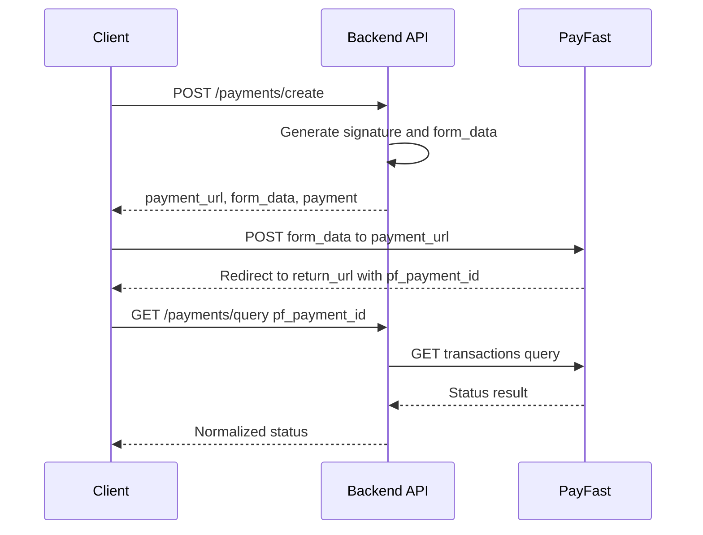

# PayFast Integration — Backend-Managed Credentials and Signatures

This plan enforces a secure, server-centric PayFast integration. All merchant credentials and signature generation live on the backend. The client only calls your FastAPI endpoints and never talks directly to PayFast except to submit the signed form returned by the backend.

Related implementation references:
- Backend endpoints: [app/api/payment_routes.py](app/api/payment_routes.py)
- Service logic: [app/services/payment_service.py](app/services/payment_service.py)
- Schemas: [app/schemas/payment_schemas.py](app/schemas/payment_schemas.py)

## Environments and Credentials

- Sandbox base URL: https://sandbox.payfast.co.za
- Production base URL: https://www.payfast.co.za

Configure via backend settings and environment variables:
- PAYFAST_ENVIRONMENT: sandbox or production
- PAYFAST_SANDBOX_URL and PAYFAST_PRODUCTION_URL
- PAYFAST_MERCHANT_ID and PAYFAST_MERCHANT_KEY
- PAYFAST_PASSPHRASE optional
- PAYFAST_RETURN_URL and PAYFAST_CANCEL_URL

Note: Credentials must never appear in client code or network payloads.

## Backend API Contracts

1. POST /payments/create
   - Auth: Bearer token required
   - Purpose: Creates a Payment record and returns PayFast form data to submit
   - Request body shape derived from [PaymentCreate](app/schemas/payment_schemas.py:7) but the server should derive user identity from auth context (see Known Gaps)
   - Client should provide minimally
     - order_id
     - amount
     - payment_type: CLIENT_PAYMENT or DRIVER_PAYMENT
     - payment_method: value from PaymentMethod
   - Response object
     - payment_url: string (e.g. https://sandbox.payfast.co.za/eng/process)
     - form_data: object (all POST fields required by PayFast including signature)
     - payment: [PaymentResponse](app/schemas/payment_schemas.py:17)

2. GET /payments/query/{pf_payment_id}
   - Auth: Bearer token required
   - Purpose: Server-side verification of transaction status with PayFast
   - Implementation reference: [router.get()](app/api/payment_routes.py:207)
   - Response mirrors PayFast API response for that transaction, including top-level status and a data object

## Server-Side Signature Generation

The backend builds the PayFast form payload and signature. Current implementation sorts keys, URL-encodes values, optionally appends passphrase, then computes MD5.

Pseudocode

1. Build data with merchant_id, merchant_key, return_url, cancel_url, name_first, name_last, email_address, m_payment_id, amount, item_name
2. Sort keys ascending
3. Concatenate key=value with URL encoding joined by ampersand
4. If passphrase present append ampersand passphrase encoded
5. signature = md5 of the resulting string

Signature generation and payload construction reference: [PaymentService.create_payment()](app/services/payment_service.py:24)

The signed payload is stored with the Payment and returned to the client as form_data.

## End to End Flow

- Client calls POST /payments/create with order context
- Backend creates Payment, generates signature, returns payment_url and form_data
- Client renders a form and POSTs form_data to payment_url
- PayFast hosts the checkout and redirects to return_url or cancel_url
- Client parses pf_payment_id and calls GET /payments/query to confirm status
- Backend queries PayFast, returns result, and updates internal records

### Mermaid sequence



## Client Integration Snippet

Example JavaScript using fetch

```javascript
async function initiatePayment(orderId, amount, token) {
  const res = await fetch('/payments/create', {
    method: 'POST',
    headers: {
      'Content-Type': 'application/json',
      'Authorization': 'Bearer ' + token
    },
    body: JSON.stringify({
      order_id: orderId,
      amount: amount,
      payment_type: 'CLIENT_PAYMENT',
      payment_method: 'CARD'
    })
  });
  const result = await res.json();
  if (!res.ok || !result.payment_url || !result.form_data) {
    throw new Error(result.detail || 'Failed to create payment');
  }
  const form = document.createElement('form');
  form.action = result.payment_url; // e.g. https://sandbox.payfast.co.za/eng/process
  form.method = 'POST';
  Object.entries(result.form_data).forEach(([k, v]) => {
    const input = document.createElement('input');
    input.type = 'hidden';
    input.name = k;
    input.value = v;
    form.appendChild(input);
  });
  document.body.appendChild(form);
  form.submit();
}
```

## Handling Return and Cancel URLs

### Success page

```javascript
const url = new URL(window.location.href);
const pfPaymentId = url.searchParams.get('pf_payment_id');
if (pfPaymentId) {
  const res = await fetch('/payments/query/' + pfPaymentId, {
    headers: { 'Authorization': 'Bearer ' + token }
  });
  const data = await res.json();
  if (data.status === 'success' && data.data && data.data.payment_status === 'COMPLETE') {
    // update UI and local state
  } else {
    // handle FAILED CANCELLED PENDING
  }
}
```

### Cancel page

```javascript
// show cancellation message and allow retry
```

## Example cURL

Create payment

```bash
curl -X POST https://your-api.example.com/payments/create ^
 -H "Authorization: Bearer YOUR_JWT" ^
 -H "Content-Type: application/json" ^
 -d "{ \"order_id\": \"ORDER_UUID\", \"amount\": \"100.00\", \"payment_type\": \"CLIENT_PAYMENT\", \"payment_method\": \"CARD\" }"
```

Query payment

```bash
curl -X GET https://your-api.example.com/payments/query/1089896 ^
 -H "Authorization: Bearer YOUR_JWT"
```

## Security Notes

- Never expose merchant_id, merchant_key, or passphrase to the client
- Enforce HTTPS for all client to backend and backend to PayFast communication
- Validate order_id ownership and amounts server side before creating payments
- Log payment lifecycle events for audit

## Sandbox Testing Checklist

- Set PAYFAST_ENVIRONMENT to sandbox and verify base URL is https://sandbox.payfast.co.za
- Ensure PAYFAST_RETURN_URL and PAYFAST_CANCEL_URL are reachable from the browser
- Create a test order and note its order_id
- Call POST /payments/create with a small amount using the example cURL; verify response contains payment_url and form_data
- Submit the generated form to PayFast and complete a sandbox checkout (card or EFT)
- On return_url, confirm the page extracts pf_payment_id and calls GET /payments/query/{pf_payment_id}
- Verify response statuses across scenarios: COMPLETE, FAILED, CANCELLED, PENDING
- Confirm Payment record status transitions and logs in the backend
- Validate that no merchant credentials appear in browser DevTools network logs
- Test network timeouts and error handling paths

## Known Implementation Gaps to Address Next

- Response model mismatch: create endpoint declares [PaymentResponse](app/schemas/payment_schemas.py:17) but returns extra fields payment_url and form_data. Introduce a dedicated response model for the create route.
- Header encoding bug: query endpoint builds Authorization Basic using httpx.b64encode (non-existent). Replace with base64.b64encode from Python stdlib in [query_payfast_transaction](app/api/payment_routes.py:207).
- Config consistency: [payment_routes](app/api/payment_routes.py:219) reads os env per environment while [PaymentService](app/services/payment_service.py:82) uses unified settings. Centralize on settings to avoid drift.
- Trust boundary: server should derive user_id from auth context and ignore any client-sent user_id in [PaymentCreate](app/schemas/payment_schemas.py:7). Update [PaymentService.create_payment()](app/services/payment_service.py:24) accordingly.

## Appendix: Direct Hosted Reference

For background on PayFast direct-hosted fields and the query API, see PayFast documentation. Do not generate signatures or include merchant credentials in client applications.