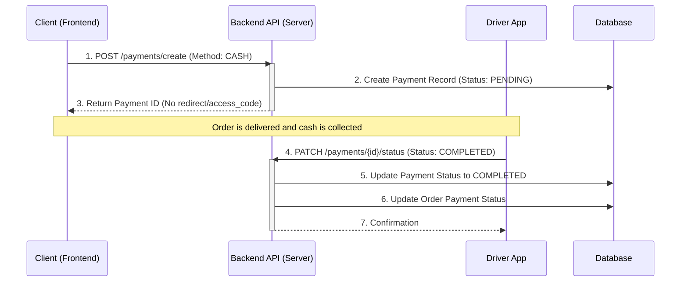

# Payment API Endpoints Documentation

This document details the API endpoints available for handling payment transactions, specifically focusing on the Paystack integration flow.

## 1. Paystack Payment Flow Overview

The Paystack integration uses a three-step process initiated by the client:

1. **Initialization:** Client requests payment initialization from the Backend. The Backend calls Paystack and returns an `access_code`.
2. **Completion:** Client uses the `access_code` with the Paystack Popup JS to complete the transaction.
3. **Verification:** Client notifies the Backend of the transaction reference, or the Backend receives a webhook, to verify the payment status and update the order.

## 2. Paystack Initialization Endpoint

This endpoint is used by the Client App to initiate a Paystack transaction for a specific order.

### `POST /api/payments/paystack/initialize`

| Detail | Description |
| :--- | :--- |
| **Method** | `POST` |
| **URL** | `/api/payments/paystack/initialize` |
| **Authentication** | Required (Client/Admin) |
| **Purpose** | Creates a PENDING payment record and requests an `access_code` from Paystack. |

#### Request Body (Schema: PaymentCreate)

The request body should contain the necessary details to create a payment record. The `gateway` field is automatically set to `PAYSTACK` by the endpoint.

```json
{
  "order_id": "string (UUID of the order)",
  "user_id": "string (ID of the client making the payment)",
  "payment_type": "client_payment",
  "amount": 5000.00,
  "currency": "ZAR",
  "payment_method": "credit_card"
}
```

#### Successful Response (200 OK)

The response provides the necessary details for the client to launch the Paystack Popup.

```json
{
  "payment": {
    "id": "string (New Payment ID)",
    "order_id": "string",
    "user_id": "string",
    "payment_type": "client_payment",
    "amount": 5000.00,
    "currency": "ZAR",
    "payment_method": "credit_card",
    "gateway": "PAYSTACK",
    "status": "pending",
    "transaction_id": "string (Paystack Reference)",
    "created_at": "datetime",
    "updated_at": "datetime"
  },
  "access_code": "string (Required for Paystack Popup)",
  "authorization_url": "string (Optional: URL for redirect if popup fails)"
}
```

## 3. Paystack Verification Endpoints

These endpoints are used to confirm the final status of a Paystack transaction.

### `POST /api/payments/paystack/webhook`

| Detail | Description |
| :--- | :--- |
| **Method** | `POST` |
| **URL** | `/api/payments/paystack/webhook` |
| **Authentication** | None (Used by Paystack API) |
| **Purpose** | Receives asynchronous notifications from Paystack (e.g., `charge.success`) to automatically verify and update payment status. |

#### Request Body

This is the raw JSON payload sent by Paystack (e.g., containing `event` and `data`).

#### Successful Response (200 OK)

The endpoint should return a 200 OK status to acknowledge receipt of the webhook, regardless of whether the event was processed.

```json
{
  "status": "success"
}
```

### `GET /api/payments/paystack/verify/{reference}`

| Detail | Description |
| :--- | :--- |
| **Method** | `GET` |
| **URL** | `/api/payments/paystack/verify/{reference}` |
| **Authentication** | Required (Client/Admin) |
| **Purpose** | Allows the client (or admin) to manually trigger verification of a transaction using the Paystack reference ID (which is the Payment ID). |

#### Path Parameter

| Parameter | Type | Description |
| :--- | :--- | :--- |
| `reference` | `string` | The Payment ID used as the Paystack transaction reference. |

#### Successful Response (200 OK)

If verification is successful and the payment status is updated:

```json
{
  "status": "verified",
  "payment": {
    // ... PaymentResponse object with status: "completed"
  }
}
```

## 4. PayFast Compatibility Endpoint

The original payment creation endpoint is retained for PayFast compatibility.

### `POST /api/payments/create`

| Detail | Description |
| :--- | :--- |
| **Method** | `POST` |
| **URL** | `/api/payments/create` |
| **Authentication** | Required (Client/Admin) |
| **Purpose** | Creates a PENDING payment record and returns PayFast form data for redirection. **Note:** If the `gateway` field in the request body is explicitly set to `PAYSTACK`, this endpoint will return a 400 error instructing the client to use `/paystack/initialize`. |

#### Successful Response (200 OK - PayFast)

```json
{
  "payment": {
    // ... PaymentResponse object with status: "pending" and gateway: "PAYFAST"
  },
  "payment_url": "string (PayFast submission URL)",
  "form_data": {
    // ... PayFast form fields including signature
  }
}
```

## 5. Cash/Offline Payment Flow

Cash payments are handled through a simplified flow that bypasses external payment gateways and relies on manual confirmation by the driver or administrator upon successful delivery.

### Payment Creation (Client Action)

The client initiates a cash payment using the generic payment creation endpoint.

#### `POST /api/payments/create`

| Detail | Description |
| :--- | :--- |
| **Method** | `POST` |
| **URL** | `/api/payments/create` |
| **Authentication** | Required (Client) |
| **Purpose** | Creates a PENDING payment record for cash payment. No external gateway interaction required. |

#### Request Body (Schema: PaymentCreate)

```json
{
  "order_id": "string (UUID of the order)",
  "user_id": "string (ID of the client making the payment)",
  "payment_type": "client_payment",
  "amount": 5000.00,
  "currency": "ZAR",
  "payment_method": "cash"
}
```

#### Successful Response (200 OK - Cash)

For cash payments, the endpoint returns the payment record directly without any redirect URL or access code.

```json
{
  "payment": {
    "id": "string (New Payment ID)",
    "order_id": "string",
    "user_id": "string",
    "payment_type": "client_payment",
    "amount": 5000.00,
    "currency": "ZAR",
    "payment_method": "cash",
    "gateway": "payfast", // Default gateway, but method indicates cash
    "status": "pending",
    "transaction_id": null,
    "created_at": "datetime",
    "updated_at": "datetime"
  }
}
```

### Payment Confirmation (Driver/Admin Action)

Once the order is delivered and cash is collected, the driver or an admin confirms the payment.

#### `PATCH /api/payments/{payment_id}/status`

| Detail | Description |
| :--- | :--- |
| **Method** | `PATCH` |
| **URL** | `/api/payments/{payment_id}/status` |
| **Authentication** | Required (Driver/Admin) |
| **Purpose** | Updates the payment status to COMPLETED and triggers order fulfillment. |

#### Path Parameter

| Parameter | Type | Description |
| :--- | :--- | :--- |
| `payment_id` | `string` | The ID of the payment record to update. |

#### Request Body (Schema: PaymentUpdate)

```json
{
  "status": "completed",
  "transaction_id": "CASH_ORDER_{order_id}" // Optional manual reference
}
```

#### Successful Response (200 OK)

```json
{
  "id": "string (Payment ID)",
  "order_id": "string",
  "user_id": "string",
  "payment_type": "client_payment",
  "amount": 5000.00,
  "currency": "ZAR",
  "payment_method": "cash",
  "gateway": "payfast",
  "status": "completed",
  "transaction_id": "CASH_ORDER_{order_id}",
  "created_at": "datetime",
  "updated_at": "datetime"
}
```

### Cash Payment Sequence Diagram



### Key Considerations for Cash Payments

- **No External Gateway:** Cash payments do not require external API calls or redirects.
- **Manual Confirmation:** Payment status remains PENDING until manually confirmed by the driver/admin.
- **Driver Accountability:** Ensures drivers confirm cash collection before order completion.
- **Order Fulfillment:** Payment completion triggers order status updates and fulfillment processes.
- **Audit Trail:** All cash payments are tracked in the database with proper timestamps.