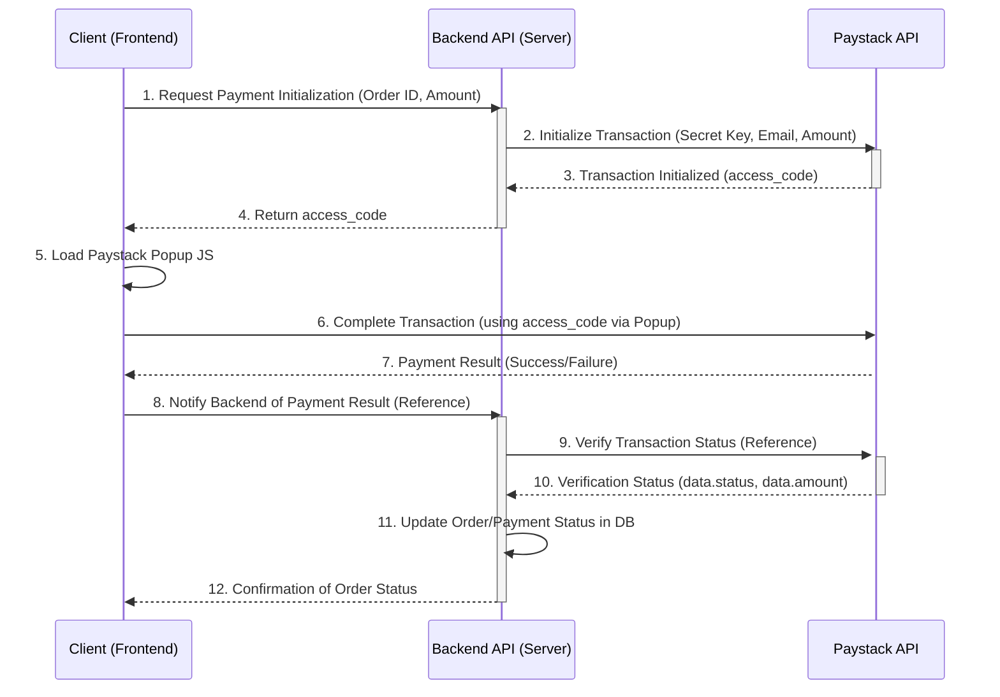

# Paystack Payment Integration Plan

This document outlines the architecture and steps required to integrate Paystack for accepting payments, focusing on the client-side initiation of the payment process via our backend API.

## 1. Payment Flow Architecture

The integration follows a secure three-step process: Initialize, Complete, and Verify. All sensitive operations (initialization and verification) must occur on the backend to protect the secret key.



## 2. Backend API: Initialize Transaction

The client initiates the payment by calling a custom backend endpoint, which in turn calls the Paystack Initialize Transaction API.

### Backend Endpoint (Example: POST /api/payments/paystack/initialize)

The client sends the necessary order details (e.g., Order ID, amount, user email) to our server.

### Paystack API Call

The backend must make a POST request to the Paystack API using the secret key for authorization.

**Endpoint:** `https://api.paystack.co/transaction/initialize`
**Method:** `POST`
**Headers:**
- `Authorization: Bearer YOUR_SECRET_KEY`
- `Content-Type: application/json`
**Body (Example):**
```json
{
    "email": "user@example.com",
    "amount": 500000, // Amount in kobo (e.g., 5000.00 ZAR/NGN)
    "currency": "ZAR" // Or NGN, GHS, USD
}
```

### Response Handling

The backend receives a response from Paystack. The critical parameter to extract and send back to the client is the `access_code`.

**Key Response Parameter:**
- `data.access_code`: This code is required by the frontend to resume the transaction.

**Security Note:** Never expose the Paystack Secret Key on the frontend. All Paystack API calls must be initiated from the server.

## 3. Client-Side Implementation: Complete Transaction

Once the client receives the `access_code` from our backend, they use the Paystack Popup JS library to complete the payment.

### Prerequisites

1. Ensure the Paystack Inline JS library is loaded on the frontend.
2. The client must have the `access_code` returned from the backend initialization step.

### Using Paystack Popup

The client uses the `resumeTransaction` method of the Paystack Popup object, passing the `access_code`.

```javascript
// Assuming PaystackPop is imported/available
const popup = new PaystackPop();

// Function to handle payment completion
function completePayment(accessCode) {
    popup.resumeTransaction(accessCode);
}

// Example of handling the response from our backend
// fetch('/api/payments/paystack/initialize', { ... })
//     .then(response => response.json())
//     .then(data => {
//         if (data.status === 'success') {
//             completePayment(data.access_code);
//         }
//     });
```

## 4. Backend API: Verify Transaction Status

After the client completes the transaction via the popup, the backend must verify the transaction status to confirm payment success before fulfilling the order.

### Verification Methods

1. **Webhooks (Recommended):** Paystack sends a notification to a designated webhook URL upon transaction completion. This is the most reliable method.
2. **Verify Transactions Endpoint:** The backend can manually call the Verify Transaction API endpoint using the transaction reference.

**Key Verification Parameters (from Paystack response):**
- `data.status`: Indicates if the payment is successful or not.
- `data.amount`: The price of the product/service. **Crucially, the backend must verify this amount against the expected order amount to prevent fraud.**